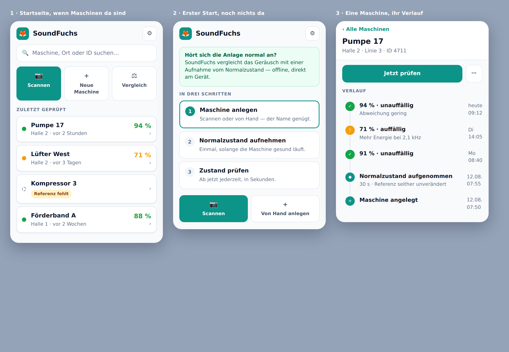

# Die Startseite: von der Leiter zum Bestand

**Stand:** 13.08.2026 · Entwurf zur Entscheidung, nicht umgesetzt

Vorschlag, die Startseite von einer Schrittleiter auf einen Maschinenbestand
umzustellen — nach dem Vorbild der Schwester-App TourFuchs, aber nicht als
Kopie. Funktionsumfang unverändert; es geht ausschließlich um Aufbau und
Bedienung.

---

## 1. Der Befund

Die Startseite zeigt drei Karten: *Maschine auswählen · Normalzustand
aufnehmen · Zustand prüfen*. Sie bilden den Ablauf beim allerersten Mal ab.

Beim Nachzählen der Einstiegspunkte fiel etwas auf, das kein Geschmacksurteil
ist, sondern messbar:

| Karte | Kacheln |
|---|---|
| Maschine auswählen | `identify-tile-scan` · `identify-tile-list` · `identify-tile-create` |
| Normalzustand aufnehmen | `reference-scan-btn` · `reference-select-btn` · `reference-create-btn` |
| Zustand prüfen | `diagnose-scan-btn` · `diagnose-select-btn` · `diagnose-create-btn` |

**Dieselben drei Aktionen, dreimal.** Identisches Markup, identischer
Kommentar `Tile 1: Scan QR/Barcode`, drei Implementierungen. Dazu je ein
`*-change-machine-btn`. Insgesamt 31 Schaltflächen in den drei Karten.

Die Ursache ist strukturell: **Der Schritt ist der Behälter, nicht die
Maschine.** Weil jeder Schritt für sich steht, muss jeder erneut fragen
„welche Maschine?". Neun Kacheln für drei Aktionen sind keine Redundanz aus
Nachlässigkeit — sie folgen zwingend aus dem Aufbau.

Zwei weitere Beobachtungen, die in dieselbe Richtung zeigen:

- Die Leiter ist **global, der Zustand ist je Maschine.** Pumpe 17 hat eine
  Referenz, Kompressor 3 nicht. Eine einzige Leiter kann das nicht abbilden.
  Bisher half sie sich, indem sie sich selbst umbaute — genau die Regel, die
  am 13.08. entfernt wurde (siehe `gestaltprinzip-soundfuchs.md`, 4.3).
- Beim zwanzigsten Öffnen kennt der Nutzer die Reihenfolge. Die Leiter kostet
  dann drei Karten Höhe, um nichts mehr zu sagen — und verdeckt das, weswegen
  er gekommen ist: seine Maschinen.

---

## 2. Der Vorschlag



*Die Skizze liegt als `bilder/startseite-entwurf.html` daneben und lässt sich
im Browser öffnen — sie nutzt dieselben Farbtokens wie die App.*

**Die Maschine wird der Behälter. Die Schritte ziehen in sie ein.**

```
┌──────────────────────────────────┐
│ 🦊 SoundFuchs               [⚙] │   Kopfzeile
├──────────────────────────────────┤
│ 🔍 Maschine, Ort oder ID suchen  │   Suche
├──────────────────────────────────┤
│ [Scannen] [Neue Maschine] [⚖]    │   drei Aktionen, immer da
├──────────────────────────────────┤
│ ZULETZT GEPRÜFT                  │
│ ● Pumpe 17      Halle 2    94 % ›│
│ ● Lüfter West   Halle 2    71 % ›│
│ ○ Kompressor 3  [Referenz fehlt] ›│
│ ● Förderband A  Halle 1    88 % ›│
└──────────────────────────────────┘
```

Eine Maschine antippen öffnet ihre Ansicht: oben Name, Ort und **Jetzt
prüfen**, darunter ihr Verlauf als Zeitstrahl — neueste Messung oben,
darunter frühere, ganz unten „Referenz aufgenommen" und „Maschine angelegt".

### Die Leiter verschwindet nicht, sie zieht um

Zwei Umzüge, und beide sind der Kern des Vorschlags:

**Erstens: Sie wird der Leerzustand.** Wer noch keine Maschine hat, sieht
weiterhin `1 · 2 · 3`. Genau da gehört eine Anleitung hin — dort gibt es
nichts anderes zu zeigen. Das ist zugleich die Antwort auf *Desert Fog*
(Jul/Furnas, UIST '98) und auf die eigene Regel „keine Ebene ohne Boden": Der
leere Bestand bekommt einen Boden, statt ins Leere zu zeigen.

**Zweitens: Ihre Aussage verteilt sich auf die Maschinen, die sie
beschreibt.** Was die Leiter global behauptete, steht künftig an jeder
Maschine einzeln:

| Zustand der Maschine | Kachel zeigt | Antippen führt zu |
|---|---|---|
| keine Referenz | `Referenz fehlt` | Normalzustand aufnehmen |
| Referenz da, nie geprüft | `bereit` | Zustand prüfen |
| geprüft | Datum · Wert · Ampel | Verlauf, oben „Jetzt prüfen" |

Damit ist die Reihenfolge nicht aufgegeben — sie ist nur dorthin gewandert,
wo sie tatsächlich gilt. Die fachliche Abhängigkeit bleibt zwingend: Ohne
Referenz kein Vergleich.

---

## 3. Was von TourFuchs übernommen wird — und was nicht

### Übernommen

**Die Suche oben.** Wörtlich das Muster von TourFuchs
(`Kunde, Ort, PLZ suchen…` → `Maschine, Ort oder ID suchen…`). Sie ist der
schnellste Weg, sobald der Bestand über eine Bildschirmhöhe wächst.

**Die einzeilige Liste mit Zustandspunkt.** Name, Nebenzeile, Wert rechts.

**Der Zeitstrahl.** In TourFuchs verbindet eine durchgehende Linie die Stopps
der Tour, der Punkt trägt eine Ziffer und wird zum Haken, wenn erledigt
(`#tour-stops .stop-row::before`). Dieselbe Bauweise trägt hier den Verlauf
einer Maschine — nur ist die Reihenfolge Zeit statt Route, also neueste oben.

**Die Familienlogik.** Gleiche Farben, gleiche Geometrie, gleiches
Maskottchen-System. Wer TourFuchs kennt, findet sich hier ohne Erklärung
zurecht. Das ist der eigentliche Gewinn einer Familie.

### Nicht übernommen: Karte und GPS

Hier widerspreche ich, und zwar aus der Sache heraus:

1. **GPS trägt drinnen nicht.** In einer Halle liegt der Fehler bei 10–50 m.
   Pumpe 17 und Pumpe 18 stehen fünf Meter auseinander. Die Karte könnte
   genau das nicht leisten, wofür man sie holt: die beiden unterscheiden.

2. **Es gibt kein Wegeproblem.** Bei TourFuchs verdient die Karte ihren Platz,
   weil Kunden Kilometer auseinanderliegen und man dazwischen fährt — die
   Reihenfolge ist eine echte Optimierungsaufgabe. Maschinen stehen Meter
   auseinander, man geht. Es gibt keine Tour zu planen.

3. **Das Problem ist bereits besser gelöst.** SoundFuchs hat NFC und QR. Der
   Tag an der Maschine ist drinnen exakt, sofort und ohne Netz — er schlägt
   jede Ortung. Eine Karte danebenzustellen hieße, die schwächere Antwort
   prominenter zu zeigen als die stärkere.

4. **Die Kosten laufen gegen die eigene Zusage.** Kacheln bedeuten einen
   Kartendienst, also Netz — oder Offline-Kacheln, also viele Megabyte. Wir
   haben den Installationsumfang gerade von 3,3 MB auf 88 KB Symbole gedrückt.

**Stattdessen: Ort als Text, und daraus Gruppierung.** Das Feld `location`
existiert im Datenmodell bereits (`Machine.location`, bisher `@internal`).
Sichtbar und editierbar gemacht, trägt es „Halle 2 · Linie 3" — genau das,
was ohnehin an der Maschine steht. Die Liste kann danach gruppieren. Das
liefert den Nutzen der Karte (Überblick, Zusammengehöriges beieinander) zu
nahezu keinem Preis.

Falls später doch eine Ortsansicht gewünscht ist, wäre der ehrliche Weg kein
Kartendienst, sondern ein **Hallenplan als Bild**, auf dem Maschinen platziert
werden. Offline, exakt, ohne Fremddienst. Das ist ein eigenes Vorhaben.

### Vertagt: Versiegeln

TourFuchs hat `.tfsafe` mit getrenntem Schlüssel-QR. Der Gedanke ist richtig,
die Rechnung aber eine andere: Eine Kundenliste sind Kilobyte, ein
SoundFuchs-Bestand sind Referenzmodelle und Audio — Megabyte. Verschlüsselung,
Schlüsselübergabe und Wiederherstellung sind hier ein eigenes Vorhaben mit
eigenen Fehlerfällen. Bewusst nicht in diesem Entwurf.

---

## 4. Nichts geht verloren

Die 31 Schaltflächen der drei Karten, und wohin sie ziehen:

| bisher | künftig |
|---|---|
| `identify-tile-scan` · `reference-scan-btn` · `diagnose-scan-btn` | **eine** Aktion *Scannen* in der Kopfzeile |
| `identify-tile-create` · `reference-create-btn` · `diagnose-create-btn` | **eine** Aktion *Neue Maschine* |
| `identify-tile-list` · `reference-select-btn` · `diagnose-select-btn` | die Liste selbst — sie *ist* die Auswahl |
| `*-change-machine-btn` (3×) | „‹ Alle Maschinen" in der Maschinenansicht |
| `record-reference-btn` · `record-btn` | in der Maschine: *Normalzustand aufnehmen* |
| `diagnose-btn` · `diagnose-auto-detect-btn` | in der Maschine: *Jetzt prüfen* |
| `quick-compare-btn` · `fleet-quickcheck-btn` · `toggle-fleet` | Aktion *Vergleich* in der Kopfzeile |
| `toggle-series` | in der Maschine unter „⋯" |
| `open-nfc-writer-btn` · `open-qr-generator-btn` | in der Maschine unter „⋯" (sie gehören zu *einer* Maschine) |
| `help-*` (5×) | unverändert, an ihren Abschnitten |
| `empty-state-cta` · `add-new-machine-btn` | Leerzustand |

Zwei Beobachtungen dazu: Die NFC- und QR-Erzeugung liegt heute auf der
Startseite, gehört aber immer zu **einer** Maschine — in der Maschinenansicht
steht sie richtiger. Und aus neun Auswahl-Kacheln werden drei Aktionen, ohne
dass ein einziger Weg verschwindet.

---

## 5. Vorgehen in Schnitten

Jeder Schnitt ist für sich lauffähig und einzeln zurückzunehmen.

1. **Maschinenliste als Startseite**, Leiter wird Leerzustand.
   Die Leiter bleibt vorerst als Ansicht bestehen und ist über die Kachel
   erreichbar — nur nicht mehr das Erste, was man sieht.
2. **Maschinenansicht mit Zeitstrahl.** `MachineHistoryModal` und
   `MachineDetailModal` liefern die Daten bereits; sie werden zu einer
   Ansicht zusammengeführt.
3. **Suche und `location`.** Feld sichtbar machen, Liste danach filtern und
   gruppieren.
4. **Aufräumen.** Die dreifachen Auswahl-Kacheln entfernen, nachdem alle Wege
   nachweislich über die neuen Einstiege laufen.

Jeder Schnitt wird mit `attention-check` gemessen; die Budgets gelten weiter.

---

## 6. Was ich als Produktowner entschieden hätte — und was nicht

**Entschieden:** Die Umstellung auf den Bestand ist richtig. Die dreifache
Frage „welche Maschine?" ist der Beleg, dass der bisherige Aufbau gegen die
Aufgabe arbeitet. Die Leiter als Leerzustand ist die Lösung, die nichts
wegwirft.

**Widersprochen:** Karte und GPS. Begründung oben — nicht weil es Aufwand
wäre, sondern weil es die schwächere Antwort auf eine Frage ist, die NFC und
QR bereits besser beantworten.

**Offen, weil es deine Entscheidung ist:**

- **Zeitstrahl je Maschine oder zusätzlich global?** Ein globaler Verlauf
  („was habe ich heute geprüft") wäre der Gegenpart zum
  *Feierabend-Rückblick* von TourFuchs. Ich würde ihn wie dort als Dialog
  bauen, nicht als Startseite — sonst konkurriert er mit der Liste um
  dieselbe Fläche.
- **Sortierung:** zuletzt geprüft zuerst, oder auffällige zuerst? Ersteres
  ist vorhersagbar, Letzteres hilfreicher. Ich neige zu „zuletzt geprüft",
  weil eine Liste, die ihre Reihenfolge nach Messwerten ändert, wieder das
  Muster wäre, das wir gerade entfernt haben.
- **Ab wann erscheint die Suche?** Bei drei Maschinen ist sie Ballast. Mein
  Vorschlag: ab acht.
